# D. Database ERD

Sixty-three tables in fourteen clusters. Relationship cardinality is shown; column detail is in E.

## D.1 Cluster overview

```
 IDENTITY & ACCESS        ORGANISATION           APPLICATION CORE
 ┌──────────────┐         ┌────────────┐         ┌──────────────────┐
 │ roles        │         │ departments│         │ application_types│
 │ permissions  │◀───┐    │ offices    │◀────┐   │ applications     │
 │ role_perms   │    │    │ zones      │     │   │ applicants       │
 │ users        │────┘    └────────────┘     └───│ property_details │
 │ user_roles   │                                │ building_details │
 │ sessions     │                                │ number_sequences │
 └──────────────┘                                └────────┬─────────┘
                                                          │
   ┌──────────────────────┬───────────────────┬───────────┼──────────────┐
   ▼                      ▼                   ▼           ▼              ▼
 DRAWINGS + SCRUTINY   DOCUMENTS           FEES        PAYMENTS      WORKFLOW
 ┌────────────────┐   ┌──────────────────┐ ┌──────────┐ ┌──────────┐ ┌───────────────┐
 │ drawings       │   │ document_types   │ │fee_struct│ │payments  │ │ workflows     │
 │ drawing_vers.  │   │ doc_requirements │ │fee_comps │ │pay_txns  │ │ wf_stages     │
 │ scrutiny_req.  │   │ app_documents    │ │fee_slabs │ │pay_hooks │ │ wf_actions    │
 │ scrutiny_res.  │   │ document_versions│ │app_fees  │ │receipts  │ │ wf_transitions│
 │ scrutiny_issue │   └──────────────────┘ │line_items│ │refunds   │ │ wf_instances  │
 │ scrutiny_rep.  │                        └──────────┘ └──────────┘ │ wf_tasks      │
 │ scrutiny_rules │                                                  │ wf_history    │
 └────────────────┘                                                  └───────┬───────┘
                                                                             │
   ┌──────────────┬─────────────────┬──────────────┬────────────────┬────────┘
   ▼              ▼                 ▼              ▼                ▼
 SHORTFALLS    SLA              NOTIFICATIONS   APPROVAL        PLATFORM
 ┌───────────┐ ┌─────────────┐  ┌─────────────┐ ┌────────────┐  ┌───────────────┐
 │shortfalls │ │ sla_rules   │  │ templates   │ │approval_   │  │ audit_logs    │
 │sf_items   │ │ sla_inst.   │  │notifications│ │  orders    │  │ system_settings│
 │sf_resolut.│ │ holidays    │  │notif_logs   │ └────────────┘  │ master_data   │
 └───────────┘ └─────────────┘  │notif_prefs  │                 │ file_objects  │
                                └─────────────┘                 │ outbox_events │
                                                                │ jobs          │
                                                                └───────────────┘

 CHECKLISTS + OTHERS  (Phase 4)
 ┌──────────────────────────────┐
 │ checklist_item_definitions   │  the 19 and 27 questions, as rows
 │ application_checklist_resp.  │  one application's answer to one question
 │ checklist_review_entries     │  APPEND-ONLY — every act, by everybody
 │ application_others           │  mortgage · insurance · solar · RWH · trees
 └──────────────────────────────┘
```

## D.1.1 The checklist cluster

### The wording is data, and that is the whole design

`checklist_item_definitions` holds the question TEXT as a row. No sentence of
any checklist question appears anywhere in the application code.

This is not generic-framework instinct. The BBAS manuals supplied for this
project **describe** the 19-point application checklist and the 27-point site
inspection checklist, and show them in screenshots, but do not reproduce the
questions as text. What they give is the subject areas. So the rows are seeded
with sentences written from those subject areas and nothing else, every one
carrying `isProvisional = true`, and the interface says so beside every
question and once at the top of the screen.

**Nothing in this system claims the seeded wording is official BBAS wording.**
Replacing it is a typing job in Settings → Checklists — no migration, no
deployment, no code change. The seed refuses to overwrite a row whose
provisional flag has been cleared, so re-running it cannot undo the correction.

### Why there are two response columns on one row

`application_checklist_responses` carries the applicant's `response` and the
reviewer's `reviewerResponse` as separate columns that never overwrite one
another, because the interesting case is the one where they DIFFER: the LTP
answered "the encumbrance certificate is enclosed" and the TPA found it
expired. One column would record only the last person to type, and the
disagreement — the entire reason an officer reviews a checklist — would vanish
the moment it was resolved.

### Why a later reviewer cannot erase an earlier one

Because the history is a different table with **no update path**.

`checklist_review_entries` is append-only, like `audit_logs` and
`workflow_history`. Every answer and every verification is written there first;
the summary row exists only so a screen can read the current state cheaply. A
ZDD who reaches a different conclusion from the TPA produces a second entry —
the TPA's is still there, with their name, their desk and their remark, and the
screen shows both in order.

The requirement is not "reviewers should be careful". It is that erasure must
be impossible, and the only way to mean that is to give the code no way to
express it: `src/server/services/application-checklist.ts` contains no update
and no delete against that table, and the application DB role has UPDATE and
DELETE revoked on it.

### The risk category is derived, never typed

`applications.riskCategory` falls out of the answers to the questions whose
definition carries `affectsRisk`, recomputed inside the same transaction as
the answer that changed it. Marking one more question risk-bearing in Settings
therefore recategorises every file, with no code change. It is stored rather
than computed on read only so the register and the dashboards can filter on it
without replaying nineteen rows per application — and `npm run demo:verify`
recomputes it by hand and complains if the two ever disagree.

## D.2 Relationship map

```mermaid
erDiagram
    ROLE ||--o{ ROLE_PERMISSION : grants
    PERMISSION ||--o{ ROLE_PERMISSION : "granted by"
    USER ||--o{ USER_ROLE : has
    ROLE ||--o{ USER_ROLE : "held by"
    USER ||--o{ SESSION : opens
    ZONE ||--o{ OFFICE : contains
    DEPARTMENT ||--o{ OFFICE : contains
    OFFICE ||--o{ USER : "posted at"
    USER ||--o{ USER_JURISDICTION : covers
    ZONE ||--o{ USER_JURISDICTION : "covered by"

    APPLICATION_TYPE ||--o{ APPLICATION : classifies
    USER ||--o{ APPLICATION : "filed by LTP"
    APPLICATION ||--|| APPLICANT : "declares"
    APPLICATION ||--|| PROPERTY_DETAIL : describes
    APPLICATION ||--|| BUILDING_DETAIL : describes

    APPLICATION ||--o{ DRAWING : has
    DRAWING ||--o{ DRAWING_VERSION : "versioned as"
    DRAWING_VERSION ||--o{ SCRUTINY_REQUEST : "submitted for"
    SCRUTINY_REQUEST ||--o| SCRUTINY_RESULT : yields
    SCRUTINY_RESULT ||--o{ SCRUTINY_ISSUE : lists
    SCRUTINY_RESULT ||--o| SCRUTINY_REPORT : "documented by"
    SCRUTINY_RULE ||--o{ SCRUTINY_ISSUE : "violated in"

    DOCUMENT_TYPE ||--o{ DOCUMENT_REQUIREMENT : "required by"
    APPLICATION ||--o{ APPLICATION_DOCUMENT : submits
    DOCUMENT_TYPE ||--o{ APPLICATION_DOCUMENT : "typed as"
    APPLICATION_DOCUMENT ||--o{ DOCUMENT_VERSION : "versioned as"

    APPLICATION_TYPE ||--o{ FEE_STRUCTURE : "priced by"
    FEE_STRUCTURE ||--o{ FEE_COMPONENT : "composed of"
    FEE_COMPONENT ||--o{ FEE_SLAB : "banded by"
    APPLICATION ||--o{ APPLICATION_FEE : "billed via"
    APPLICATION_FEE ||--o{ FEE_LINE_ITEM : "itemised as"
    FEE_COMPONENT ||--o{ FEE_LINE_ITEM : "snapshot of"

    APPLICATION_FEE ||--o{ PAYMENT : "settled by"
    PAYMENT ||--o{ PAYMENT_TRANSACTION : attempts
    PAYMENT ||--o| PAYMENT_RECEIPT : issues
    PAYMENT ||--o{ REFUND : "reversed by"
    PAYMENT_WEBHOOK_EVENT }o--o| PAYMENT : "reconciles"

    WORKFLOW ||--o{ WORKFLOW_STAGE : defines
    WORKFLOW ||--o{ WORKFLOW_TRANSITION : defines
    WORKFLOW_ACTION ||--o{ WORKFLOW_TRANSITION : triggers
    WORKFLOW_STAGE ||--o{ WORKFLOW_TRANSITION : "from"
    APPLICATION ||--|| WORKFLOW_INSTANCE : "tracked by"
    WORKFLOW ||--o{ WORKFLOW_INSTANCE : instantiates
    WORKFLOW_INSTANCE ||--o{ WORKFLOW_TASK : assigns
    WORKFLOW_INSTANCE ||--o{ WORKFLOW_HISTORY : records
    WORKFLOW_STAGE ||--o{ WORKFLOW_TASK : "at"
    USER ||--o{ WORKFLOW_TASK : "claimed by"

    WORKFLOW_HISTORY ||--o{ SHORTFALL : raises
    APPLICATION ||--o{ SHORTFALL : "encumbered by"
    SHORTFALL ||--o{ SHORTFALL_ITEM : itemises
    SHORTFALL ||--o{ SHORTFALL_RESOLUTION : "answered by"
    SHORTFALL_ITEM ||--o{ SHORTFALL_ITEM_RESPONSE : "answered line by line"
    SHORTFALL_RESOLUTION ||--o{ SHORTFALL_ITEM_RESPONSE : "covers"
    SHORTFALL_ITEM }o--o| DOCUMENT_TYPE : "demands"
    SHORTFALL }o--o| APPLICATION_FEE : "demands payment of"

    WORKFLOW_STAGE ||--o{ SLA_RULE : "timed by"
    WORKFLOW_TASK ||--|| SLA_INSTANCE : "clocked by"
    SLA_RULE ||--o{ SLA_INSTANCE : "started from"
    APPLICATION ||--o{ NOTIFICATION_LOG : "messages about"
    USER ||--o{ NOTIFICATION_LOG : "messages to"

    NOTIFICATION_TEMPLATE ||--o{ NOTIFICATION_LOG : renders
    USER ||--o{ NOTIFICATION : receives
    APPLICATION ||--o{ NOTIFICATION : concerns

    APPLICATION ||--o| APPROVAL_ORDER : "concluded by"
    USER ||--o{ AUDIT_LOG : performs
    FILE_OBJECT ||--o{ DRAWING_VERSION : stores
    FILE_OBJECT ||--o{ DOCUMENT_VERSION : stores
```



## D.3 Conventions applied to every table

- **Primary key** `String @id @default(cuid())`. No sequential integers exposed in URLs.
- **Timestamps** `createdAt` / `updatedAt` on every mutable table.
- **Soft delete** `deletedAt DateTime?` on master and user-facing tables. **Never** on append-only tables (history, audit, versions, transactions) — those cannot be deleted at all.
- **Actor columns** `createdById` / `updatedById` where a human acted.
- **Money** `Decimal @db.Decimal(18,2)`. Areas and ratios `Float`. Never float for money.
- **JSON** real `Json` columns for structured blobs (transition effects, captured form data, audit before/after), never stringified text.
- **Enums** native Postgres enums for values the engine branches on; plain `String` + `master_data` for values an administrator may extend without a migration.
- **Indexes** every FK, every `(entity, entityId)` pair, every column used in a dashboard filter, and partial indexes on hot predicates such as open tasks.

> **Note (Phase 0):** the primary key convention became `uuid(7)` rather than `cuid()` — time-sortable, so it keeps the index locality that makes people reach for cuid in the first place. Everything below still holds.

---

## D.4 Two identifiers, and why they are not the same thing

Every application carries **two** identifiers. Conflating them would be a security bug, so the split is deliberate and enforced.

| | **`id`** | **`applicationNumber`** |
|---|---|---|
| Example | `01a03d94-fd68-7241-9b98-92d278143795` | `BP/2026/000001` |
| Type | `uuid(7)`, primary key | `String @unique` |
| Audience | machines | people |
| Used by | every URL, foreign key, API path | correspondence, receipts, orders, the register |
| Guessable | no | **yes — by design** |

**The number is sequential, therefore it must never be an access key.** Anyone holding `BP/2026/000042` can trivially construct `…000041` and `…000043`. So no read path accepts it: `getApplication()`, `saveStep()`, `submitApplication()` and every API route take the UUID and merge the caller's row scope into the query. Asking for an application *by number* does not resolve at all — asserted by test ("cannot be fetched by application number, only by id").

The UUID is the opposite: unguessable, and useless without authorization anyway, because the scope fragment is part of the `WHERE` clause rather than a check performed afterwards.

### Format

Configurable, not hard-coded. Rendered by `formatNumber()` in `src/server/services/numbering.ts` from the `application_number_format` system setting:

```
{prefix}/{year}/{seq:6}   →   BP/2026/000001
```

| Token | Source |
|---|---|
| `{prefix}` | `application_types.numberPrefix` — `BP`, `LP`, or whatever an administrator configures |
| `{year}` | calendar year of filing |
| `{seq:n}` | per-scope counter, zero-padded to `n` |

An administrator can reorder or restyle it (`{year}/{prefix}/{seq:4}` → `2026/LP/0012`) without a code change. No mandated format was supplied — open question **Q16** — so per architectural Rule 6 this is configuration with a safe default rather than an invented constant. The example in the original requirement, `APP/2026/000001`, is one setting away: change a type's `numberPrefix` to `APP`.

### Sequences are scoped per type and per year

The counter scope is `application:{prefix}:{year}`, so each application type keeps its own series and each year restarts at 1:

```
BP/2026/000001      LP/2026/000001      BP/2027/000001
```

Those three coexist. A building permission and a layout approval may hold the same sequence number without colliding, because the prefix is part of the scope — asserted by test.

### Allocation is concurrency-safe and gap-free

`lams_next_sequence()` (installed by the Phase 2 migration) does the read-modify-write in **one statement**:

```sql
INSERT INTO number_sequences (scope, current) VALUES ($1, 1)
ON CONFLICT (scope) DO UPDATE SET current = number_sequences.current + 1
RETURNING current;
```

Postgres holds a row lock for the duration, so two concurrent filings get 42 and 43 — never 42 twice. The naive `SELECT` then `UPDATE` gives both 42, and the unique index on `applicationNumber` would catch it only *after* the applicant had filled in a ten-step form.

It is called **inside the transaction that inserts the application**, so the allocation commits with the row or not at all. That is the opposite trade-off to a Postgres `SEQUENCE`, which never blocks but leaves holes on rollback: a statutory register with missing numbers invites "what happened to BP/2026/000042?", and there must always be an answer. Verified by test with 20 parallel creates → 20 distinct, consecutive numbers.

---

## D.5 Nullability carries meaning

Across `applicants`, `property_details` and `building_details`:

| Column shape | Means |
|---|---|
| **nullable** | Required to FILE, but legitimately absent in a `DRAFT`. `NULL` = the LTP has not answered yet. |
| **`NOT NULL @default`** | Genuinely optional even on a filed application. `''` and `0` are real answers. |

The filing wizard builds these rows a step at a time — and several mandatory columns of the *same* table belong to *different* steps — so the rows exist before every value is supplied. Rather than storing a placeholder, the absence is recorded as absence.

This matters most for measurements. A `plotAreaSqm` of `0` is not an unmeasured plot; it is a false claim, and no later reader — a report, an export, a scrutiny engine — could tell the two apart. `mandal`, `parkingAreaSqm` and `numBasements` keep their defaults, because empty and zero are meaningful answers for them.

Nothing is relaxed by this. `DRAFT` and `SUBMITTED` are different states with different rules, and `submitApplication()` re-derives completeness from these rows through the same step schemas the form used, returning a field-level reason for each one that is missing.

---

# E. Full Database Schema

Prisma schema. This is the design artefact; it becomes `prisma/schema.prisma` at Phase 0.

```prisma
generator client {
  provider = "prisma-client-js"
}

datasource db {
  provider  = "postgresql"
  url       = env("DATABASE_URL")   // pooled — application
  directUrl = env("DIRECT_URL")     // direct — migrations
}

// ═══════════════════════════════════════════════════════════════════
// ENUMS — only values the engine branches on
// ═══════════════════════════════════════════════════════════════════

enum UserStatus { ACTIVE INACTIVE LOCKED SUSPENDED }

enum ApplicationStatus {
  // LTP-side
  DRAFT
  DRAWING_UPLOADED
  SCRUTINY_IN_PROGRESS
  SCRUTINY_FAILED
  SCRUTINY_PASSED
  DOCUMENT_UPLOAD_PENDING
  DOCUMENTS_COMPLETED
  FEE_GENERATED
  PAYMENT_PENDING
  PAYMENT_FAILED
  PAYMENT_SUCCESSFUL
  SUBMITTED
  // Department-side
  PENDING_TPA
  TPA_REVIEW
  TPA_DOCUMENT_SHORTFALL
  TPA_FEE_SHORTFALL
  TPA_TECHNICAL_SHORTFALL
  PENDING_ZAD_ZDD
  ZAD_ZDD_REVIEW
  ZAD_ZDD_SHORTFALL
  PENDING_ZJD
  ZJD_REVIEW
  ZJD_SHORTFALL
  ZJD_FEE_SHORTFALL
  PENDING_DIRECTOR_DP
  DIRECTOR_REVIEW
  DIRECTOR_SHORTFALL
  DIRECTOR_REPORTED_SHORTFALL
  PENDING_ADDITIONAL_COMMISSIONER
  ADDITIONAL_COMMISSIONER_REVIEW
  ADDITIONAL_COMMISSIONER_SHORTFALL
  PENDING_COMMISSIONER
  COMMISSIONER_REVIEW
  // Terminal
  APPROVED
  REJECTED
  WITHDRAWN
  LAPSED
}

enum StageType { LTP_ACTION REVIEW APPROVAL TERMINAL }

/// What an action fundamentally does. Labels and routing stay configurable;
/// this is only what the engine needs to reason about.
enum ActionKind {
  FORWARD              // advance to the next stage
  RETURN               // send back for correction, blocking
  REPORT_AND_FORWARD   // record an issue but keep advancing
  APPROVE
  REJECT
  RESUBMIT             // LTP answers a parked shortfall
  CLARIFY
}

enum WorkflowInstanceStatus { ACTIVE PARKED COMPLETED CANCELLED }
enum TaskStatus { PENDING IN_PROGRESS COMPLETED CANCELLED REASSIGNED }

enum ScrutinyStatus { QUEUED RUNNING COMPLETED ERRORED CANCELLED }
enum ScrutinyOutcome { PASS FAIL }
enum IssueSeverity { CRITICAL MAJOR MINOR INFO }

enum DocumentStatus { NOT_UPLOADED UPLOADED UNDER_VERIFICATION VERIFIED REJECTED SUPERSEDED }
enum ScanStatus { PENDING CLEAN INFECTED SKIPPED FAILED }

enum FeeDemandType { ORIGINAL SHORTFALL REVISION }
enum FeeDemandStatus { DRAFT ISSUED PARTIALLY_PAID PAID CANCELLED WAIVED }
enum CalculationBasis { FLAT PER_UNIT_AREA SLAB PERCENTAGE FORMULA }

/// The six states of the payment specification, plus the two either side.
/// INITIATED is before the gateway has been told anything; PROCESSING is the
/// payer at the gateway. They are kept apart because they fail differently.
enum PaymentStatus { INITIATED PENDING PROCESSING SUCCESS FAILED CANCELLED TIMEOUT REFUNDED }
enum RefundStatus { REQUESTED PROCESSING COMPLETED FAILED }

enum ShortfallKind { DOCUMENT FEE TECHNICAL CLARIFICATION }
enum ShortfallStatus { OPEN RESPONDED UNDER_REVIEW RESOLVED REJECTED CANCELLED }
/// BLOCKING parks the workflow. REPORTED travels with the application.
enum ShortfallMode { BLOCKING REPORTED }

enum SlaStatus { ON_TRACK DUE_SOON OVERDUE COMPLETED PAUSED }
enum SlaCalendar { CALENDAR_DAYS WORKING_DAYS }

enum NotificationChannel { IN_APP EMAIL SMS }
enum DeliveryStatus { QUEUED SENT DELIVERED FAILED SKIPPED }

enum OrderStatus { DRAFT ISSUED REVOKED }
enum JobStatus { PENDING RUNNING SUCCEEDED FAILED DEAD }
enum SettingType { STRING NUMBER BOOLEAN JSON }

// ═══════════════════════════════════════════════════════════════════
// 1. IDENTITY & ACCESS
// ═══════════════════════════════════════════════════════════════════

model Role {
  id          String   @id @default(cuid())
  key         String   @unique          // LTP, TPA, ZAD, ...
  name        String
  description String   @default("")
  isSystem    Boolean  @default(false)  // cannot be deleted or renamed
  rank        Int      @default(0)      // display + escalation ordering
  createdAt   DateTime @default(now())
  updatedAt   DateTime @updatedAt
  deletedAt   DateTime?

  permissions RolePermission[]
  users       UserRole[]
  @@map("roles")
}

model Permission {
  id       String @id @default(cuid())
  key      String @unique              // APPLICATION_CREATE, ...
  module   String                      // applications, fees, ...
  name     String
  description String @default("")

  roles RolePermission[]
  @@index([module])
  @@map("permissions")
}

model RolePermission {
  roleId       String
  permissionId String
  grantedAt    DateTime @default(now())
  grantedById  String?

  role       Role       @relation(fields: [roleId], references: [id], onDelete: Cascade)
  permission Permission @relation(fields: [permissionId], references: [id], onDelete: Cascade)
  @@id([roleId, permissionId])
  @@map("role_permissions")
}

model User {
  id             String     @id @default(cuid())
  email          String     @unique
  phone          String?
  passwordHash   String
  name           String
  designation    String     @default("")
  employeeCode   String?    @unique
  status         UserStatus @default(ACTIVE)

  departmentId   String?
  officeId       String?
  primaryZoneId  String?

  // LTP-specific registration details (null for departmental users)
  ltpLicenceNo     String?  @unique
  ltpLicenceClass  String?
  ltpValidUpto     DateTime?
  firmName         String?

  mustChangePassword Boolean  @default(false)
  failedLoginCount   Int      @default(0)
  lockedUntil        DateTime?
  lastLoginAt        DateTime?
  createdAt          DateTime @default(now())
  updatedAt          DateTime @updatedAt
  deletedAt          DateTime?
  createdById        String?

  department    Department?       @relation(fields: [departmentId], references: [id])
  office        Office?           @relation(fields: [officeId], references: [id])
  primaryZone   Zone?             @relation("UserPrimaryZone", fields: [primaryZoneId], references: [id])
  roles         UserRole[]
  jurisdictions UserJurisdiction[]
  sessions      Session[]
  applications  Application[]     @relation("ApplicationLtp")
  tasks         WorkflowTask[]
  notifications Notification[]
  preferences   NotificationPreference[]

  @@index([status, deletedAt])
  @@index([officeId])
  @@index([primaryZoneId])
  @@map("users")
}

model UserRole {
  userId     String
  roleId     String
  assignedAt DateTime @default(now())
  assignedById String?

  user User @relation(fields: [userId], references: [id], onDelete: Cascade)
  role Role @relation(fields: [roleId], references: [id], onDelete: Cascade)
  @@id([userId, roleId])
  @@map("user_roles")
}

model Session {
  id            String   @id @default(cuid())
  userId        String
  tokenHash     String   @unique      // hash of the refresh token, never the token
  ip            String   @default("")
  userAgent     String   @default("")
  createdAt     DateTime @default(now())
  lastSeenAt    DateTime @default(now())
  expiresAt     DateTime               // idle expiry, slid forward
  absoluteUntil DateTime               // hard ceiling, never extended
  revokedAt     DateTime?
  revokedReason String?

  user User @relation(fields: [userId], references: [id], onDelete: Cascade)
  @@index([userId, revokedAt])
  @@map("sessions")
}

model PasswordReset {
  id        String   @id @default(cuid())
  userId    String
  tokenHash String   @unique
  expiresAt DateTime
  usedAt    DateTime?
  createdAt DateTime @default(now())
  requestIp String   @default("")
  @@index([userId])
  @@map("password_resets")
}

model LoginAttempt {
  id        String   @id @default(cuid())
  email     String
  ip        String
  success   Boolean
  reason    String   @default("")
  createdAt DateTime @default(now())
  @@index([email, createdAt])
  @@index([ip, createdAt])
  @@map("login_attempts")
}

// ═══════════════════════════════════════════════════════════════════
// 2. ORGANISATION
// ═══════════════════════════════════════════════════════════════════

model Department {
  id        String   @id @default(cuid())
  code      String   @unique
  name      String
  isActive  Boolean  @default(true)
  createdAt DateTime @default(now())
  updatedAt DateTime @updatedAt
  deletedAt DateTime?
  offices   Office[]
  users     User[]
  @@map("departments")
}

model Zone {
  id        String   @id @default(cuid())
  code      String   @unique
  name      String
  isActive  Boolean  @default(true)
  createdAt DateTime @default(now())
  updatedAt DateTime @updatedAt
  deletedAt DateTime?

  offices       Office[]
  applications  Application[]
  users         User[]             @relation("UserPrimaryZone")
  jurisdictions UserJurisdiction[]
  @@map("zones")
}

model Office {
  id           String   @id @default(cuid())
  code         String   @unique
  name         String
  departmentId String?
  zoneId       String?
  address      String   @default("")
  isActive     Boolean  @default(true)
  createdAt    DateTime @default(now())
  updatedAt    DateTime @updatedAt
  deletedAt    DateTime?

  department Department? @relation(fields: [departmentId], references: [id])
  zone       Zone?       @relation(fields: [zoneId], references: [id])
  users      User[]
  @@index([zoneId])
  @@map("offices")
}

/// An officer may cover more than one zone. Task routing unions primaryZone
/// with these rows.
model UserJurisdiction {
  userId String
  zoneId String
  user   User @relation(fields: [userId], references: [id], onDelete: Cascade)
  zone   Zone @relation(fields: [zoneId], references: [id], onDelete: Cascade)
  @@id([userId, zoneId])
  @@map("user_jurisdictions")
}

// ═══════════════════════════════════════════════════════════════════
// 3. APPLICATION CORE
// ═══════════════════════════════════════════════════════════════════

model ApplicationType {
  id                  String   @id @default(cuid())
  code                String   @unique   // RESIDENTIAL_BUILDING, LAYOUT, ...
  name                String
  description         String   @default("")
  workflowId          String
  numberPrefix        String   @default("BP")
  requiresScrutiny    Boolean  @default(true)
  isActive            Boolean  @default(true)
  metadata            Json     @default("{}")
  createdAt           DateTime @default(now())
  updatedAt           DateTime @updatedAt
  deletedAt           DateTime?

  workflow       Workflow        @relation(fields: [workflowId], references: [id])
  applications   Application[]
  feeStructures  FeeStructure[]
  docRequirements DocumentRequirement[]
  slaRules       SlaRule[]
  @@map("application_types")
}

model Application {
  id                String            @id @default(cuid())
  applicationNumber String            @unique
  applicationTypeId String
  ltpUserId         String
  zoneId            String?
  officeId          String?
  status            ApplicationStatus @default(DRAFT)

  submittedAt   DateTime?
  approvedAt    DateTime?
  rejectedAt    DateTime?
  closedAt      DateTime?

  // Denormalised for list performance — maintained by the engine, never edited
  currentStageId   String?
  currentStageCode String?
  slaDueAt         DateTime?
  slaStatus        SlaStatus?
  openShortfalls   Int      @default(0)

  createdAt DateTime  @default(now())
  updatedAt DateTime  @updatedAt
  deletedAt DateTime?

  applicationType ApplicationType   @relation(fields: [applicationTypeId], references: [id])
  ltp             User              @relation("ApplicationLtp", fields: [ltpUserId], references: [id])
  zone            Zone?             @relation(fields: [zoneId], references: [id])
  applicant       Applicant?
  property        PropertyDetail?
  building        BuildingDetail?
  drawings        Drawing[]
  documents       ApplicationDocument[]
  fees            ApplicationFee[]
  shortfalls      Shortfall[]
  workflowInstance WorkflowInstance?
  approvalOrder   ApprovalOrder?
  notifications   Notification[]

  @@index([ltpUserId, status])
  @@index([status, updatedAt])
  @@index([zoneId, status])
  @@index([currentStageCode, slaStatus])
  @@index([applicationTypeId])
  @@map("applications")
}

model Applicant {
  id            String @id @default(cuid())
  applicationId String @unique

  // Applicant
  name        String
  fatherName  String  @default("")
  email       String  @default("")
  phone       String
  aadhaarLast4 String @default("")   // last 4 only — never the full number
  panMasked   String  @default("")
  address     String  @default("")

  // Owner — may differ from the applicant
  ownerSameAsApplicant Boolean @default(true)
  ownerName            String  @default("")
  ownerPhone           String  @default("")
  ownerAddress         String  @default("")

  createdAt DateTime @default(now())
  updatedAt DateTime @updatedAt

  application Application @relation(fields: [applicationId], references: [id], onDelete: Cascade)
  @@map("applicants")
}

model PropertyDetail {
  id            String @id @default(cuid())
  applicationId String @unique

  district      String
  mandal        String  @default("")
  village       String  @default("")
  localityName  String  @default("")
  wardNo        String  @default("")
  streetName    String  @default("")
  doorNo        String  @default("")
  pincode       String  @default("")

  surveyNumbers String                 // comma-separated; parsed list in metadata
  plotNo        String  @default("")
  layoutName    String  @default("")
  lpNumber      String  @default("")

  plotAreaSqm     Float
  roadWidthM      Float   @default(0)
  landUseZone     String  @default("")   // master_data
  tenureType      String  @default("")

  latitude      Float?
  longitude     Float?
  boundaryNorth String @default("")
  boundarySouth String @default("")
  boundaryEast  String @default("")
  boundaryWest  String @default("")

  metadata  Json     @default("{}")
  createdAt DateTime @default(now())
  updatedAt DateTime @updatedAt

  application Application @relation(fields: [applicationId], references: [id], onDelete: Cascade)
  @@map("property_details")
}

model BuildingDetail {
  id            String @id @default(cuid())
  applicationId String @unique

  buildingUse      String  @default("")   // master_data
  buildingSubUse   String  @default("")
  occupancyType    String  @default("")
  structureType    String  @default("")

  numFloors        Int     @default(0)
  numBasements     Int     @default(0)
  numDwellingUnits Int     @default(0)
  buildingHeightM  Float   @default(0)

  plotAreaSqm      Float   @default(0)
  builtUpAreaSqm   Float   @default(0)
  floorAreaSqm     Float   @default(0)
  coverageAreaSqm  Float   @default(0)
  parkingAreaSqm   Float   @default(0)

  achievedFar      Float   @default(0)
  achievedCoverage Float   @default(0)

  setbackFrontM Float @default(0)
  setbackRearM  Float @default(0)
  setbackLeftM  Float @default(0)
  setbackRightM Float @default(0)

  /// Everything the fee engine and scrutiny may read. Kept open so new
  /// variables do not need a migration.
  metadata  Json     @default("{}")
  createdAt DateTime @default(now())
  updatedAt DateTime @updatedAt

  application Application @relation(fields: [applicationId], references: [id], onDelete: Cascade)
  @@map("building_details")
}

/// Gap-free application numbers, allocated under a row lock.
model NumberSequence {
  id        String   @id @default(cuid())
  scope     String                       // "BP-2026" etc.
  current   Int      @default(0)
  updatedAt DateTime @updatedAt
  @@unique([scope])
  @@map("number_sequences")
}

// ═══════════════════════════════════════════════════════════════════
// 4. FILES
// ═══════════════════════════════════════════════════════════════════

/// One row per stored object. Nothing else records a storage key, so
/// retention, scanning and deletion have exactly one place to look.
model FileObject {
  id           String     @id @default(cuid())
  storageKey   String     @unique     // provider path — never sent to a client
  bucket       String     @default("")
  originalName String
  mimeType     String
  sizeBytes    Int
  checksumSha256 String   @default("")
  scanStatus   ScanStatus @default(PENDING)
  scanDetail   String     @default("")
  uploadedById String
  createdAt    DateTime   @default(now())
  deletedAt    DateTime?

  drawingVersions  DrawingVersion[]
  documentVersions DocumentVersion[]
  @@index([scanStatus])
  @@map("file_objects")
}

// ═══════════════════════════════════════════════════════════════════
// 5. DRAWINGS & SCRUTINY
// ═══════════════════════════════════════════════════════════════════

model Drawing {
  id            String   @id @default(cuid())
  applicationId String
  discipline    String   @default("ARCHITECTURAL")
  title         String   @default("Building Drawing")
  currentVersionNo Int   @default(0)
  createdAt     DateTime @default(now())
  updatedAt     DateTime @updatedAt

  application Application      @relation(fields: [applicationId], references: [id], onDelete: Cascade)
  versions    DrawingVersion[]
  @@index([applicationId])
  @@map("drawings")
}

/// Append-only. A correction is always a new row.
model DrawingVersion {
  id           String   @id @default(cuid())
  drawingId    String
  versionNo    Int
  fileObjectId String
  remarks      String   @default("")
  uploadedById String
  uploadedAt   DateTime @default(now())
  isActive     Boolean  @default(true)   // exactly one true per drawing

  drawing          Drawing           @relation(fields: [drawingId], references: [id], onDelete: Cascade)
  file             FileObject        @relation(fields: [fileObjectId], references: [id])
  scrutinyRequests ScrutinyRequest[]

  @@unique([drawingId, versionNo])
  @@index([drawingId, isActive])
  @@map("drawing_versions")
}

model ScrutinyRule {
  id          String        @id @default(cuid())
  code        String        @unique
  name        String
  category    String        @default("")
  severity    IssueSeverity @default(MAJOR)
  description String        @default("")
  reference   String        @default("")   // byelaw clause, filled once known
  isActive    Boolean       @default(true)
  createdAt   DateTime      @default(now())
  updatedAt   DateTime      @updatedAt

  issues ScrutinyIssue[]
  @@map("scrutiny_rules")
}

model ScrutinyRequest {
  id               String         @id @default(cuid())
  drawingVersionId String
  engineDriver     String         @default("mock")
  externalRef      String?
  status           ScrutinyStatus @default(QUEUED)
  attempt          Int            @default(1)
  requestedById    String
  requestedAt      DateTime       @default(now())
  startedAt        DateTime?
  completedAt      DateTime?
  errorMessage     String         @default("")

  drawingVersion DrawingVersion  @relation(fields: [drawingVersionId], references: [id], onDelete: Cascade)
  result         ScrutinyResult?
  @@index([status])
  @@index([drawingVersionId])
  @@map("scrutiny_requests")
}

model ScrutinyResult {
  id                String          @id @default(cuid())
  scrutinyRequestId String          @unique
  outcome           ScrutinyOutcome
  criticalCount     Int             @default(0)
  majorCount        Int             @default(0)
  minorCount        Int             @default(0)
  summary           String          @default("")
  rawPayload        Json            @default("{}")
  evaluatedAt       DateTime        @default(now())

  request ScrutinyRequest  @relation(fields: [scrutinyRequestId], references: [id], onDelete: Cascade)
  issues  ScrutinyIssue[]
  report  ScrutinyReport?
  @@map("scrutiny_results")
}

model ScrutinyIssue {
  id               String        @id @default(cuid())
  scrutinyResultId String
  ruleId           String?
  ruleCode         String
  severity         IssueSeverity
  title            String
  description      String        @default("")
  expectedValue    String        @default("")
  actualValue      String        @default("")
  layer            String        @default("")
  locationHint     Json          @default("{}")   // page, coordinates for overlay

  result ScrutinyResult @relation(fields: [scrutinyResultId], references: [id], onDelete: Cascade)
  rule   ScrutinyRule?  @relation(fields: [ruleId], references: [id])
  @@index([scrutinyResultId, severity])
  @@map("scrutiny_issues")
}

model ScrutinyReport {
  id               String   @id @default(cuid())
  scrutinyResultId String   @unique
  storageKey       String
  generatedAt      DateTime @default(now())
  result ScrutinyResult @relation(fields: [scrutinyResultId], references: [id], onDelete: Cascade)
  @@map("scrutiny_reports")
}

// ═══════════════════════════════════════════════════════════════════
// 6. DOCUMENTS
// ═══════════════════════════════════════════════════════════════════

model DocumentType {
  id             String   @id @default(cuid())
  code           String   @unique
  name           String
  description    String   @default("")
  category       String   @default("")
  allowedMime    String[] @default(["application/pdf"])
  maxSizeMb      Int      @default(10)
  requiresExpiry Boolean  @default(false)
  isActive       Boolean  @default(true)
  createdAt      DateTime @default(now())
  updatedAt      DateTime @updatedAt
  deletedAt      DateTime?

  requirements  DocumentRequirement[]
  appDocuments  ApplicationDocument[]
  shortfallItems ShortfallItem[]
  @@map("document_types")
}

/// "Which documents are required for this application?" is answered by
/// evaluating these rows against the application. Never hard-coded.
model DocumentRequirement {
  id                String   @id @default(cuid())
  applicationTypeId String?              // null = all types
  documentTypeId    String
  isMandatory       Boolean  @default(true)
  /// JSON condition evaluated against the application context, e.g.
  /// { "gt": ["building.numFloors", 3] }. Empty = always applies.
  condition         Json     @default("{}")
  stageCode         String   @default("DOCUMENT_UPLOAD")
  displayOrder      Int      @default(0)
  helpText          String   @default("")
  isActive          Boolean  @default(true)
  createdAt         DateTime @default(now())
  updatedAt         DateTime @updatedAt

  applicationType ApplicationType? @relation(fields: [applicationTypeId], references: [id])
  documentType    DocumentType     @relation(fields: [documentTypeId], references: [id])
  @@index([applicationTypeId, isActive])
  @@map("document_requirements")
}

model ApplicationDocument {
  id              String         @id @default(cuid())
  applicationId   String
  documentTypeId  String
  status          DocumentStatus @default(NOT_UPLOADED)
  isMandatory     Boolean        @default(true)
  currentVersionNo Int           @default(0)
  /// Set when the document exists only to answer a shortfall.
  shortfallItemId String?
  verifiedById    String?
  verifiedAt      DateTime?
  verifyRemarks   String         @default("")
  createdAt       DateTime       @default(now())
  updatedAt       DateTime       @updatedAt

  application  Application       @relation(fields: [applicationId], references: [id], onDelete: Cascade)
  documentType DocumentType      @relation(fields: [documentTypeId], references: [id])
  versions     DocumentVersion[]

  @@unique([applicationId, documentTypeId])
  @@index([applicationId, status])
  @@map("application_documents")
}

/// Append-only.
model DocumentVersion {
  id                    String         @id @default(cuid())
  applicationDocumentId String
  versionNo             Int
  fileObjectId          String
  status                DocumentStatus @default(UPLOADED)
  remarks               String         @default("")
  expiresOn             DateTime?
  uploadedById          String
  uploadedAt            DateTime       @default(now())
  isActive              Boolean        @default(true)

  document ApplicationDocument @relation(fields: [applicationDocumentId], references: [id], onDelete: Cascade)
  file     FileObject          @relation(fields: [fileObjectId], references: [id])

  @@unique([applicationDocumentId, versionNo])
  @@map("document_versions")
}

// ═══════════════════════════════════════════════════════════════════
// 7. FEES
// ═══════════════════════════════════════════════════════════════════

model FeeStructure {
  id                String    @id @default(cuid())
  code              String
  name              String
  version           Int       @default(1)
  applicationTypeId String?              // null = applies to all
  effectiveFrom     DateTime
  effectiveTo       DateTime?
  roundingRule      String    @default("NEAREST_1")  // NONE | NEAREST_1 | NEAREST_10 | UP_10
  isActive          Boolean   @default(true)
  notes             String    @default("")
  createdAt         DateTime  @default(now())
  updatedAt         DateTime  @updatedAt
  createdById       String?

  applicationType ApplicationType? @relation(fields: [applicationTypeId], references: [id])
  components      FeeComponent[]

  @@unique([code, version])
  @@index([applicationTypeId, isActive, effectiveFrom])
  @@map("fee_structures")
}

model FeeComponent {
  id             String           @id @default(cuid())
  feeStructureId String
  code           String
  name           String
  headOfAccount  String           @default("")
  basis          CalculationBasis
  /// FLAT → rate is the amount.
  /// PER_UNIT_AREA → rate × variable named by `variable`.
  /// PERCENTAGE → rate% of the component named by `percentOfCode`.
  /// SLAB → banded by FeeSlab rows.
  /// FORMULA → `expression`, evaluated in a sandbox (see N).
  rate           Decimal?         @db.Decimal(18,4)
  variable       String           @default("")   // builtUpAreaSqm, plotAreaSqm, ...
  percentOfCode  String           @default("")
  expression     String           @default("")
  minAmount      Decimal?         @db.Decimal(18,2)
  maxAmount      Decimal?         @db.Decimal(18,2)
  /// Empty = always charged.
  condition      Json             @default("{}")
  isRefundable   Boolean          @default(false)
  displayOrder   Int              @default(0)
  isActive       Boolean          @default(true)

  structure FeeStructure @relation(fields: [feeStructureId], references: [id], onDelete: Cascade)
  slabs     FeeSlab[]
  lineItems FeeLineItem[]

  @@unique([feeStructureId, code])
  @@map("fee_components")
}

model FeeSlab {
  id             String   @id @default(cuid())
  feeComponentId String
  fromValue      Decimal  @db.Decimal(18,4)
  toValue        Decimal? @db.Decimal(18,4)   // null = open ended
  rate           Decimal  @db.Decimal(18,4)
  flatAmount     Decimal? @db.Decimal(18,2)
  displayOrder   Int      @default(0)

  component FeeComponent @relation(fields: [feeComponentId], references: [id], onDelete: Cascade)
  @@index([feeComponentId, fromValue])
  @@map("fee_slabs")
}

/// A demand. Immutable once ISSUED — a correction is a new demand.
model ApplicationFee {
  id             String          @id @default(cuid())
  applicationId  String
  demandNumber   String          @unique
  type           FeeDemandType   @default(ORIGINAL)
  status         FeeDemandStatus @default(DRAFT)

  feeStructureId      String
  feeStructureVersion Int
  /// The exact variable values used, frozen at issue time. Re-running the
  /// calculator later must never change an issued demand.
  calculationInputs   Json     @default("{}")

  subtotal   Decimal @db.Decimal(18,2) @default(0)
  totalAmount Decimal @db.Decimal(18,2) @default(0)
  paidAmount  Decimal @db.Decimal(18,2) @default(0)

  raisedByShortfallId String?
  dueDate    DateTime?
  issuedAt   DateTime?
  paidAt     DateTime?
  cancelledAt DateTime?
  cancelReason String  @default("")
  createdAt  DateTime @default(now())
  updatedAt  DateTime @updatedAt

  application Application   @relation(fields: [applicationId], references: [id], onDelete: Cascade)
  lineItems   FeeLineItem[]
  payments    Payment[]
  shortfall   Shortfall?    @relation("ShortfallDemand", fields: [raisedByShortfallId], references: [id])

  @@index([applicationId, status])
  @@map("application_fees")
}

/// A frozen snapshot. Carries how the number was reached so an officer can
/// audit a fee without re-running anything.
model FeeLineItem {
  id               String  @id @default(cuid())
  applicationFeeId String
  feeComponentId   String?
  componentCode    String
  componentName    String
  headOfAccount    String  @default("")
  basis            String
  variableName     String  @default("")
  variableValue    Decimal? @db.Decimal(18,4)
  rateApplied      Decimal? @db.Decimal(18,4)
  computedAmount   Decimal @db.Decimal(18,2)
  amount           Decimal @db.Decimal(18,2)   // after min/max/rounding
  calculationNote  String  @default("")
  displayOrder     Int     @default(0)

  fee       ApplicationFee @relation(fields: [applicationFeeId], references: [id], onDelete: Cascade)
  component FeeComponent?  @relation(fields: [feeComponentId], references: [id])
  @@index([applicationFeeId])
  @@map("fee_line_items")
}

// ═══════════════════════════════════════════════════════════════════
// 8. PAYMENTS
// ═══════════════════════════════════════════════════════════════════

model Payment {
  id               String        @id @default(cuid())
  applicationFeeId String
  paymentRef       String        @unique   // our reference sent to the gateway
  provider         String        @default("mock")
  amount           Decimal       @db.Decimal(18,2)
  status           PaymentStatus @default(INITIATED)
  /// Which attempt against this demand. A retry is a NEW row, never an edit;
  /// `payment_one_open_per_demand` makes a second live attempt impossible.
  attemptNo        Int           @default(1)

  initiatedById String
  initiatedAt   DateTime  @default(now())
  settledAt     DateTime?
  failureReason String    @default("")
  /// Set the first time a webhook or verification call settles this payment.
  /// Guards against double-crediting on duplicate callbacks.
  settlementLockAt DateTime?
  createdAt DateTime @default(now())
  updatedAt DateTime @updatedAt

  fee          ApplicationFee       @relation(fields: [applicationFeeId], references: [id])
  transactions PaymentTransaction[]
  receipt      PaymentReceipt?
  refunds      Refund[]
  webhookEvents PaymentWebhookEvent[]

  @@index([applicationFeeId, status])
  @@index([status, initiatedAt])
  @@map("payments")
}

/// One row per interaction with the gateway. Never updated after insert.
model PaymentTransaction {
  id            String        @id @default(cuid())
  paymentId     String
  attemptNo     Int           @default(1)
  direction     String        // INITIATE | RETURN | WEBHOOK | VERIFY | RECONCILE
  status        PaymentStatus
  gatewayTxnId  String?
  bankRef       String        @default("")
  method        String        @default("")   // UPI, NETBANKING, CARD
  amount        Decimal?      @db.Decimal(18,2)
  /// Provider payload with secrets stripped before persistence.
  rawPayload    Json          @default("{}")
  message       String        @default("")
  occurredAt    DateTime      @default(now())

  payment Payment @relation(fields: [paymentId], references: [id], onDelete: Cascade)
  @@index([paymentId, occurredAt])
  @@index([gatewayTxnId])
  @@map("payment_transactions")
}

/// Every callback lands here first. The unique key makes duplicate delivery
/// a no-op instead of a double credit.
model PaymentWebhookEvent {
  id           String   @id @default(cuid())
  provider     String
  externalId   String
  paymentId    String?
  signatureOk  Boolean  @default(false)
  processed    Boolean  @default(false)
  processedAt  DateTime?
  payload      Json
  receivedAt   DateTime @default(now())
  error        String   @default("")

  payment Payment? @relation(fields: [paymentId], references: [id])
  @@unique([provider, externalId])
  @@index([processed, receivedAt])
  @@map("payment_webhook_events")
}

model PaymentReceipt {
  id            String   @id @default(cuid())
  paymentId     String   @unique
  receiptNumber String   @unique
  amount        Decimal  @db.Decimal(18,2)
  issuedAt      DateTime @default(now())
  storageKey    String   @default("")
  snapshot      Json     @default("{}")   // frozen payer + line items

  payment Payment @relation(fields: [paymentId], references: [id], onDelete: Cascade)
  @@map("payment_receipts")
}

model Refund {
  id           String       @id @default(cuid())
  paymentId    String
  amount       Decimal      @db.Decimal(18,2)
  reason       String
  status       RefundStatus @default(REQUESTED)
  externalRef  String?
  requestedById String
  requestedAt  DateTime     @default(now())
  completedAt  DateTime?

  payment Payment @relation(fields: [paymentId], references: [id])
  @@map("refunds")
}

// ═══════════════════════════════════════════════════════════════════
// 9. WORKFLOW
// ═══════════════════════════════════════════════════════════════════

model Workflow {
  id          String   @id @default(cuid())
  code        String
  name        String
  version     Int      @default(1)
  isPublished Boolean  @default(false)
  publishedAt DateTime?
  description String   @default("")
  createdAt   DateTime @default(now())
  updatedAt   DateTime @updatedAt

  stages           WorkflowStage[]
  transitions      WorkflowTransition[]
  instances        WorkflowInstance[]
  applicationTypes ApplicationType[]

  @@unique([code, version])
  @@map("workflows")
}

model WorkflowStage {
  id             String    @id @default(cuid())
  workflowId     String
  code           String                 // TPA_REVIEW, ZJD_REVIEW, ...
  name           String
  type           StageType @default(REVIEW)
  sequence       Int
  /// Roles that may act at this stage. Multiple = any one of them.
  ownerRoleKeys  String[]
  /// Status the application takes when it arrives here.
  entryStatus    ApplicationStatus
  /// Status while an owner is actively working it.
  workingStatus  ApplicationStatus?
  slaDays        Int       @default(0)
  isTerminal     Boolean   @default(false)
  allowReassign  Boolean   @default(true)
  description    String    @default("")
  isActive       Boolean   @default(true)

  workflow    Workflow             @relation(fields: [workflowId], references: [id], onDelete: Cascade)
  fromTrans   WorkflowTransition[] @relation("FromStage")
  toTrans     WorkflowTransition[] @relation("ToStage")
  tasks       WorkflowTask[]
  slaRules    SlaRule[]

  @@unique([workflowId, code])
  @@index([workflowId, sequence])
  @@map("workflow_stages")
}

/// Catalogue of actions. Reusable across stages — a stage becomes able to
/// perform one by having a transition row.
model WorkflowAction {
  id              String     @id @default(cuid())
  code            String     @unique   // FORWARD, RAISE_FEE_SHORTFALL, ...
  label           String
  kind            ActionKind
  /// Rendered intent: primary | secondary | destructive
  intent          String     @default("secondary")
  /// The capability an actor must hold. Configuration, not code — granting the
  /// Additional Commissioner the power to report a shortfall and forward is an
  /// admin edit. Empty falls back to the KIND's default, which is restrictive.
  capabilityKey   String     @default("")
  requiresRemarks Boolean    @default(true)
  requiresAttachment Boolean @default(false)
  confirmText     String     @default("")
  displayOrder    Int        @default(0)
  isActive        Boolean    @default(true)

  transitions WorkflowTransition[]
  @@map("workflow_actions")
}

/// THE routing table. (stage, status?, action, role) → (stage, status) + effects.
/// Nothing in the codebase encodes routing except these rows.
model WorkflowTransition {
  id           String  @id @default(cuid())
  workflowId   String
  fromStageId  String
  actionId     String
  /// Null = applies whatever the current status is.
  fromStatus   ApplicationStatus?
  /// Null when the effect decides — RETURN_TO_ORIGIN resumes the parked stage.
  toStageId    String?
  toStatus     ApplicationStatus
  /// Subset of the from-stage owners. Empty = all owners of the stage.
  allowedRoleKeys String[] @default([])

  /// Preconditions, all must hold. e.g. ["documents_complete","fees_paid"]
  guards       String[] @default([])
  /// Ordered side effects. e.g.
  /// [{"type":"RAISE_SHORTFALL","kind":"FEE","mode":"BLOCKING"}]
  effects      Json     @default("[]")
  /// Event code emitted on success; drives notification templates.
  notifyEvent  String   @default("")
  /// START | PAUSE | RESUME | STOP | NONE
  slaBehavior  String   @default("START")
  priority     Int      @default(0)
  isActive     Boolean  @default(true)
  createdAt    DateTime @default(now())
  updatedAt    DateTime @updatedAt

  workflow  Workflow       @relation(fields: [workflowId], references: [id], onDelete: Cascade)
  fromStage WorkflowStage  @relation("FromStage", fields: [fromStageId], references: [id], onDelete: Cascade)
  toStage   WorkflowStage? @relation("ToStage", fields: [toStageId], references: [id])
  action    WorkflowAction @relation(fields: [actionId], references: [id])

  @@unique([workflowId, fromStageId, actionId, fromStatus])
  @@index([workflowId, fromStageId])
  @@map("workflow_transitions")
}

model WorkflowInstance {
  id            String                 @id @default(cuid())
  applicationId String                 @unique
  workflowId    String
  workflowVersion Int
  currentStageId String?
  status        WorkflowInstanceStatus @default(ACTIVE)
  /// Where to resume after a blocking shortfall is accepted. This is what
  /// keeps "return to LTP then back" out of the code.
  parkedStageId String?
  parkedAt      DateTime?
  startedAt     DateTime               @default(now())
  completedAt   DateTime?

  application Application       @relation(fields: [applicationId], references: [id], onDelete: Cascade)
  workflow    Workflow          @relation(fields: [workflowId], references: [id])
  tasks       WorkflowTask[]
  history     WorkflowHistory[]
  @@map("workflow_instances")
}

model WorkflowTask {
  id            String     @id @default(cuid())
  instanceId    String
  stageId       String
  /// Role-addressed until an officer claims it.
  assignedRoleKey String
  assignedUserId  String?
  zoneId          String?
  status        TaskStatus @default(PENDING)
  /// Higher sorts first in the officer queue. Stamped from the assignment rule
  /// that routed the task, so "this zone's files are urgent" is configuration.
  priority      Int        @default(0)
  receivedAt    DateTime   @default(now())
  claimedAt     DateTime?
  completedAt   DateTime?
  completedById String?
  actionTaken   String     @default("")

  instance WorkflowInstance @relation(fields: [instanceId], references: [id], onDelete: Cascade)
  stage    WorkflowStage    @relation(fields: [stageId], references: [id])
  assignee User?            @relation(fields: [assignedUserId], references: [id])
  sla      SlaInstance?

  @@index([assignedRoleKey, status])
  @@index([assignedUserId, status])
  @@index([instanceId, status])
  @@map("workflow_tasks")
}

/// WHO a stage's work is addressed to — the routing table for TASKS, in the
/// same spirit as `workflow_transitions` is the routing table for the file.
///
/// Without this the engine would have to decide, and a stage-to-role map in
/// code is exactly the hard-coding the engine exists to avoid. The most
/// specific active row wins: a rule naming this zone beats a rule naming none.
/// With no row at all the stage's own `ownerRoleKeys[0]` is used, so adding a
/// stage does not require remembering to add a rule as well.
model WorkflowAssignment {
  id         String @id @default(cuid())
  workflowId String
  stageId    String
  /// Must be one of the stage's ownerRoleKeys — checked before publishing.
  roleKey    String
  /// Null = every zone. A zone-specific row outranks it.
  zoneId     String?
  /// Only meaningful for DIRECT, and required by a CHECK constraint for it.
  userId     String?

  /// ROLE_QUEUE (default) · DIRECT · LEAST_LOADED · ROUND_ROBIN
  strategy AssignmentStrategy @default(ROLE_QUEUE)
  /// Stamped onto tasks this rule routes.
  priority Int                @default(0)
  isActive Boolean            @default(true)
  notes    String             @default("")

  workflow Workflow      @relation(fields: [workflowId], references: [id], onDelete: Cascade)
  stage    WorkflowStage @relation(fields: [stageId], references: [id], onDelete: Cascade)
  zone     Zone?         @relation(fields: [zoneId], references: [id])
  user     User?         @relation(fields: [userId], references: [id])

  @@unique([stageId, roleKey, zoneId])
  @@map("workflow_assignments")
}

/// Append-only. One row per action performed. Never updated, never deleted.
model WorkflowHistory {
  id            String   @id @default(cuid())
  instanceId    String
  sequence      Int
  fromStageCode String   @default("")
  toStageCode   String   @default("")
  fromStatus    String   @default("")
  toStatus      String   @default("")
  actionCode    String
  actionLabel   String   @default("")
  /// Null when the SYSTEM acted. A confirmed payment carrying a file to the
  /// department has no officer behind it, and naming one would be a fiction on
  /// a record quoted back to applicants. `actorName` still reads "System".
  actorId       String?
  actorName     String
  actorRoleKey  String
  remarks       String   @default("")
  attachments   Json     @default("[]")
  effectsApplied Json    @default("[]")
  occurredAt    DateTime @default(now())

  instance   WorkflowInstance @relation(fields: [instanceId], references: [id], onDelete: Cascade)
  shortfalls Shortfall[]

  @@unique([instanceId, sequence])
  @@index([instanceId, occurredAt])
  @@map("workflow_history")
}

// ═══════════════════════════════════════════════════════════════════
// 10. SHORTFALLS
// ═══════════════════════════════════════════════════════════════════

model Shortfall {
  id              String          @id @default(cuid())
  applicationId   String
  shortfallNumber String          @unique
  kind            ShortfallKind
  mode            ShortfallMode   @default(BLOCKING)
  status          ShortfallStatus @default(OPEN)

  raisedAtStageCode String
  raisedById        String
  raisedByRoleKey   String
  raisedAt          DateTime      @default(now())
  historyId         String?
  title             String
  description       String
  dueDate           DateTime?

  respondedAt   DateTime?
  closedAt      DateTime?
  closedById    String?
  closureRemarks String   @default("")

  application Application            @relation(fields: [applicationId], references: [id], onDelete: Cascade)
  history     WorkflowHistory?       @relation(fields: [historyId], references: [id])
  items       ShortfallItem[]
  resolutions ShortfallResolution[]
  feeDemands  ApplicationFee[]       @relation("ShortfallDemand")

  @@index([applicationId, status])
  @@index([status, mode])
  @@map("shortfalls")
}

model ShortfallItem {
  id             String  @id @default(cuid())
  shortfallId    String
  documentTypeId String?               // for DOCUMENT shortfalls
  description    String
  amount         Decimal? @db.Decimal(18,2)  // for FEE shortfalls
  isResolved     Boolean  @default(false)
  resolvedAt     DateTime?
  displayOrder   Int      @default(0)

  shortfall    Shortfall     @relation(fields: [shortfallId], references: [id], onDelete: Cascade)
  documentType DocumentType? @relation(fields: [documentTypeId], references: [id])
  @@map("shortfall_items")
}

/// Each LTP response and each officer verdict. Append-only, so a rejected
/// resolution followed by a second attempt is fully visible.
model ShortfallResolution {
  id           String   @id @default(cuid())
  shortfallId  String
  attemptNo    Int
  respondedById String
  respondedAt  DateTime @default(now())
  response     String
  attachments  Json     @default("[]")

  reviewedById  String?
  reviewedAt    DateTime?
  accepted      Boolean?
  reviewRemarks String   @default("")

  shortfall Shortfall @relation(fields: [shortfallId], references: [id], onDelete: Cascade)
  @@unique([shortfallId, attemptNo])
  @@map("shortfall_resolutions")
}

// ═══════════════════════════════════════════════════════════════════
// 11. SLA
// ═══════════════════════════════════════════════════════════════════

model SlaRule {
  id                String      @id @default(cuid())
  workflowStageId   String
  applicationTypeId String?
  days              Int
  calendar          SlaCalendar @default(WORKING_DAYS)
  warnAtPercent     Int         @default(70)
  escalateToRoleKey String?
  pauseOnShortfall  Boolean     @default(true)
  isActive          Boolean     @default(true)
  createdAt         DateTime    @default(now())
  updatedAt         DateTime    @updatedAt

  stage           WorkflowStage    @relation(fields: [workflowStageId], references: [id], onDelete: Cascade)
  applicationType ApplicationType? @relation(fields: [applicationTypeId], references: [id])
  @@unique([workflowStageId, applicationTypeId])
  @@map("sla_rules")
}

model SlaInstance {
  id          String    @id @default(cuid())
  taskId      String    @unique
  ruleId      String?
  startedAt   DateTime  @default(now())
  dueAt       DateTime
  pausedAt    DateTime?
  pausedMs    Int       @default(0)
  completedAt DateTime?
  status      SlaStatus @default(ON_TRACK)
  overdueAt   DateTime?
  overdueDays Int       @default(0)
  escalatedAt DateTime?

  task WorkflowTask @relation(fields: [taskId], references: [id], onDelete: Cascade)
  @@index([status, dueAt])
  @@map("sla_instances")
}

model Holiday {
  id     String   @id @default(cuid())
  date   DateTime @unique @db.Date
  name   String
  zoneId String?
  @@map("holidays")
}

// ═══════════════════════════════════════════════════════════════════
// 12. NOTIFICATIONS
// ═══════════════════════════════════════════════════════════════════

model NotificationTemplate {
  id          String              @id @default(cuid())
  eventCode   String
  channel     NotificationChannel
  locale      String              @default("en")
  subject     String              @default("")
  body        String
  /// DLT template id — mandatory for Indian SMS delivery.
  providerTemplateId String       @default("")
  variables   String[]            @default([])
  isActive    Boolean             @default(true)
  createdAt   DateTime            @default(now())
  updatedAt   DateTime            @updatedAt

  logs NotificationLog[]
  @@unique([eventCode, channel, locale])
  @@map("notification_templates")
}

/// In-app notification centre.
model Notification {
  id            String   @id @default(cuid())
  userId        String
  applicationId String?
  eventCode     String
  title         String
  message       String
  link          String   @default("")
  isRead        Boolean  @default(false)
  readAt        DateTime?
  createdAt     DateTime @default(now())

  user        User         @relation(fields: [userId], references: [id], onDelete: Cascade)
  application Application? @relation(fields: [applicationId], references: [id])
  @@index([userId, isRead, createdAt])
  @@map("notifications")
}

/// One row per recipient per channel per event — the delivery audit.
model NotificationLog {
  id            String              @id @default(cuid())
  templateId    String?
  eventCode     String
  channel       NotificationChannel
  recipientUserId String?
  recipient     String                 // email or msisdn, as sent
  subject       String              @default("")
  body          String
  status        DeliveryStatus      @default(QUEUED)
  provider      String              @default("")
  providerRef   String              @default("")
  errorMessage  String              @default("")
  attempts      Int                 @default(0)
  sentAt        DateTime?
  createdAt     DateTime            @default(now())

  template NotificationTemplate? @relation(fields: [templateId], references: [id])
  @@index([eventCode, createdAt])
  @@index([status, attempts])
  @@map("notification_logs")
}

model NotificationPreference {
  userId    String
  eventCode String
  channel   NotificationChannel
  enabled   Boolean @default(true)

  user User @relation(fields: [userId], references: [id], onDelete: Cascade)
  @@id([userId, eventCode, channel])
  @@map("notification_preferences")
}

// ═══════════════════════════════════════════════════════════════════
// 13. APPROVAL
// ═══════════════════════════════════════════════════════════════════

model ApprovalOrder {
  id            String      @id @default(cuid())
  applicationId String      @unique
  orderNumber   String      @unique
  status        OrderStatus @default(DRAFT)
  issuedById    String
  issuedAt      DateTime    @default(now())
  validUntil    DateTime?
  conditions    Json        @default("[]")
  storageKey    String      @default("")
  /// Frozen copy of everything printed on the order.
  snapshot      Json        @default("{}")
  /// Public verification token behind /verify-order/[orderNumber].
  verificationCode String   @unique
  signatureRef  String      @default("")
  revokedAt     DateTime?
  revokeReason  String      @default("")

  application Application @relation(fields: [applicationId], references: [id], onDelete: Cascade)
  @@map("approval_orders")
}

// ═══════════════════════════════════════════════════════════════════
// 14. PLATFORM
// ═══════════════════════════════════════════════════════════════════

/// Append-only and hash-chained. The application DB role is granted
/// INSERT and SELECT only — see Q.
model AuditLog {
  id            String   @id @default(cuid())
  actorId       String?
  actorName     String   @default("")
  actorRoleKey  String   @default("")
  action        String
  entityType    String
  entityId      String
  applicationId String?
  before        Json?
  after         Json?
  remarks       String   @default("")
  ip            String   @default("")
  userAgent     String   @default("")
  correlationId String   @default("")
  /// Tamper evidence: sha256(prevHash + canonical(row)).
  prevHash      String   @default("")
  rowHash       String   @default("")
  occurredAt    DateTime @default(now())
  /// Append order, and the ONLY order the chain may be walked in.
  /// `occurredAt` is a millisecond timestamp that rows tie on routinely, and
  /// two rows in the same millisecond can be read in either order — which
  /// reports a break in a chain that is intact. Added in Phase 4/5 along with
  /// the advisory lock that makes appends serial; see docs/09-delivery-plan.md.
  seq           BigInt   @unique @default(autoincrement())

  @@index([entityType, entityId])
  @@index([applicationId, occurredAt])
  @@index([actorId, occurredAt])
  @@index([action, occurredAt])
  @@map("audit_logs")
}

model SystemSetting {
  id          String      @id @default(cuid())
  key         String      @unique
  value       String
  type        SettingType @default(STRING)
  group       String      @default("general")
  label       String      @default("")
  description String      @default("")
  isSecret    Boolean     @default(false)   // never serialised to a client
  updatedAt   DateTime    @updatedAt
  updatedById String?
  @@index([group])
  @@map("system_settings")
}

/// Administrator-extensible lists — land use, occupancy, structure type.
/// Extending one must never need a migration.
model MasterData {
  id           String   @id @default(cuid())
  category     String
  code         String
  label        String
  parentCode   String?
  displayOrder Int      @default(0)
  metadata     Json     @default("{}")
  isActive     Boolean  @default(true)
  createdAt    DateTime @default(now())
  updatedAt    DateTime @updatedAt
  @@unique([category, code])
  @@index([category, isActive])
  @@map("master_data")
}

/// Transactional outbox — written inside the business transaction.
model OutboxEvent {
  id            String    @id @default(cuid())
  eventCode     String
  applicationId String?
  payload       Json
  processed     Boolean   @default(false)
  processedAt   DateTime?
  attempts      Int       @default(0)
  lastError     String    @default("")
  createdAt     DateTime  @default(now())
  @@index([processed, createdAt])
  @@map("outbox_events")
}

model Job {
  id          String    @id @default(cuid())
  type        String
  payload     Json      @default("{}")
  status      JobStatus @default(PENDING)
  runAt       DateTime  @default(now())
  attempts    Int       @default(0)
  maxAttempts Int       @default(5)
  lockedAt    DateTime?
  lockedBy    String?
  lastError   String    @default("")
  createdAt   DateTime  @default(now())
  completedAt DateTime?
  /// Optional natural key — makes enqueueing idempotent.
  dedupeKey   String?   @unique
  @@index([status, runAt])
  @@map("jobs")
}
```

## E.1 Constraints beyond Prisma

These go in hand-written migrations, because Prisma cannot express them:

```sql
-- Exactly one active version per drawing / document
CREATE UNIQUE INDEX drawing_one_active
  ON drawing_versions (drawing_id) WHERE is_active;
CREATE UNIQUE INDEX document_one_active
  ON document_versions (application_document_id) WHERE is_active;
CREATE UNIQUE INDEX bim_model_one_active
  ON bim_model_versions ("bimModelId") WHERE "isActive";

-- A demand can never be over-paid
ALTER TABLE application_fees
  ADD CONSTRAINT paid_not_over_total CHECK (paid_amount <= total_amount);

-- Money is never negative
ALTER TABLE fee_line_items ADD CONSTRAINT amount_non_negative CHECK (amount >= 0);
ALTER TABLE payments      ADD CONSTRAINT payment_positive     CHECK (amount > 0);

-- Only one open workflow instance per application
CREATE UNIQUE INDEX one_active_instance
  ON workflow_instances (application_id) WHERE status IN ('ACTIVE','PARKED');

-- Only one open task per instance
CREATE UNIQUE INDEX one_open_task
  ON workflow_tasks (instance_id) WHERE status IN ('PENDING','IN_PROGRESS');

-- Audit is append-only for the application role
REVOKE UPDATE, DELETE, TRUNCATE ON audit_logs        FROM lams_app;
REVOKE UPDATE, DELETE, TRUNCATE ON workflow_history  FROM lams_app;
REVOKE UPDATE, DELETE, TRUNCATE ON payment_transactions FROM lams_app;

-- Hot officer queue, and the ordering the inbox actually applies
CREATE INDEX open_tasks_by_role
  ON workflow_tasks (assigned_role_key, received_at)
  WHERE status IN ('PENDING','IN_PROGRESS');
CREATE INDEX open_tasks_by_priority
  ON workflow_tasks (assigned_role_key, priority DESC, received_at)
  WHERE status IN ('PENDING','IN_PROGRESS');

-- Routing must not be ambiguous.
--
-- The model's unique key on (workflow, from_stage, action, from_status) does
-- NOT stop two "applies to any status" rows, because NULL <> NULL in a unique
-- index. Two matching rows would make the engine's routing decision depend on
-- physical row order, which is precisely what the transition table exists to
-- prevent.
CREATE UNIQUE INDEX transition_one_any_status
  ON workflow_transitions (workflow_id, from_stage_id, action_id)
  WHERE from_status IS NULL;

-- Same nullable-column problem, same fix: one catch-all assignment rule per
-- (stage, role), so "the most specific active row wins" is deterministic.
CREATE UNIQUE INDEX assignment_one_default_per_role
  ON workflow_assignments (stage_id, role_key) WHERE zone_id IS NULL;

-- A rule may name a person only when it says it addresses one.
ALTER TABLE workflow_assignments
  ADD CONSTRAINT assignment_user_matches_strategy
  CHECK ((strategy = 'DIRECT') = (user_id IS NOT NULL));

-- Exactly one entry stage per workflow: reachability is computed FROM it, so
-- two would validate the graph against whichever the query happened to return.
CREATE UNIQUE INDEX workflow_one_entry_stage
  ON workflow_stages (workflow_id) WHERE is_entry;
```

The `REVOKE` statements matter: §27 says the audit history must not be editable, and an ORM-level convention is not enforcement. A compromised application cannot rewrite history if the database will not let it.
